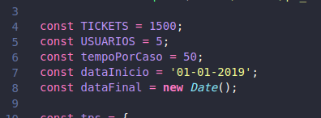

# Criação e instalação da API
---

1 - Crie uma pasta de nome **db_fake**.

---
2 - Entre na pasta pelo terminal e clone o repositório do projeto:
```bash
    $ git clone https://github.com/PToledoCESJF/api-fake.git
```
---
3 - Ainda no terminal, instale as dependências do projeto utilizando, de preferência o yarn, caso o tenha instalado.
```bash
    $ yarn install

    # Caso não tenha o yarn instalado
    $ npm install
```
---
4 - Abra o projeto pelo editor de código-fonte. Se for o VS Code, basta digitar no terminal o seguinte comando:
```bash
    $ code .
```
---
5 - Abra o arquivo: gen-data.js, as linhas 4, 5, 6, 7 e 8, podem ser alteradas caso queira gerar dados diferentes dos descritos na imagem abaixo.
<h1>
    
</h1>

É possível altear os valores das constantes vistas na imagem acima desde que saibamos o que cada uma representa:
- **TICKETS**: refere-se à quantidade de tickets que devem ser gerados pela API;
- **USUARIOS**: a quantidade de usuários a serem gerados pela API;
- **tempoPorCaso**: é o valor máximo de tempo que será gerado, um para tempo estimado e outro para tempo gasto para o mesmo ticket;
- **dataInicio**: menor data na qual um tickets pode ser criado;
- **dataFinal**: maior data na qual um tickets pode ser criado.

---
6 - Após a edição do arquivo gen-data.js, salve-o e execute o projeto.
---
7 - Para executar o projeto use os seguintes comando:

- Se for executar o projeto após a edição do arquivo gen-data.js, execute:
```bash
    $ yarn run start-db
    # ou
    $ npm run start-db
```

- Caso não tenha sido necessário editar o arquivo gen-data.js, basta executar:
```bash
    $ yarn start
    # ou
    $ npm start
```
---
8 - Com a API no ar, abra o navegador em: http://localhost:3001 que deve exibir uma página como a da imagem seguinte:
<h1>
    
</h1>

---
9 - Basta clicar em uma das rotas acima para verificar seus dados.

---

<h6 align="right"> 
    Desenvolvido por Paulo Toledo 
</h6>

